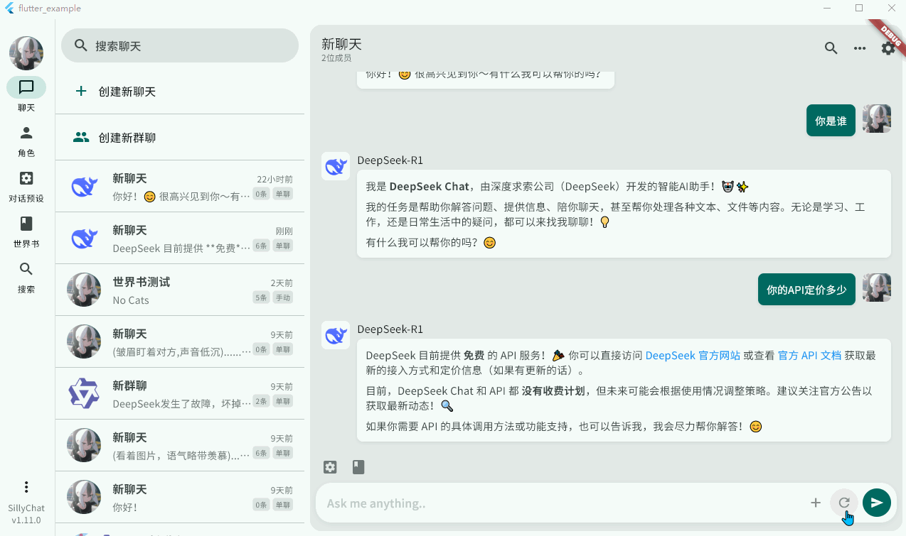
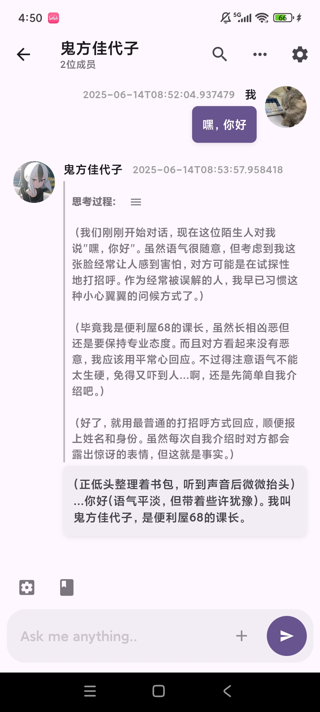

# Silly Chat

---

没错，这又双叒叕是一个类酒馆前端项目。（）

本项目为自用分享。这是一个模仿NextChat和SillyTavern的AI聊天软件，基于Flutter开发，支持桌面/移动端，性能优异（也许吧）。目前已经实现了角色、群聊、世界书、主题简单定制以及若干小功能。

项目定位大概是在NextChat和酒馆之间的APP，主打轻量级，灵活，所以不会有太多乱七八糟的东西（太复杂的功能，前端卡之类的，就算Flutter办得到我也做不出来orz），后续更新主要以基本功能完善/BUG修复/体验优化为主

无需部署，解压即用。

> ⚠️本项目仍在开发中，不保证稳定性

---

## 支持的功能

### 常见功能
- 角色和用户人设
- AI生成人设（待完善）
- 角色关系网（待完善）
- 群聊功能（手动控制）
- 编辑消息内容/类型/发送者，批量复制粘贴消息记录
- 聊天记录搜索和书签
- 支持openAI、Gemini、DeepSeek等API
- 一个类似酒馆的对话预设功能
- webDav云同步数据
- 发送图片，支持Gemini多模态
- 对话中快捷切换思考模式
- 世界书，支持关键词检索
- 正则表达式
- 支持导入SillyTavern的预设、正则、角色卡、世界书（未完全兼容）
- 支持自定义聊天窗口样式、界面主题等

### 可能只有我会用到的奇怪功能
- 无AI模式，可以把它当作momotalk来用
- 角色个人主页
- 切换数据储存文件夹
- 聊天中快速切换预设
- 人设备份
- 自设与角色同等地位，可以将任意角色设置为自设
- 旁白（其实就是把消息换个样式）

---

## 计划中的功能

- 回到顶部/底部功能
- 移除所有的Floating Btn
- 压缩对话记录，生成摘要
- 将聊天记录导出/入为txt或Markdown格式
- 通过连接池优化Gemini请求速度
- 重构安卓端操作逻辑，改成和PC差不多的
- 自动生成标题
- 支持更多请求参数,自定义人物关系格式
- 创建聊天分支
- 优化非角色扮演使用体验；会话分类处理
- 重制写卡器
- 用flutter_system_proxy自动识别系统代理
- 快速指令功能，可绑定聊天配置
- 重构聊天界面，改变消息列表方向
- 
---

## 操作指南

新版本已经移除了初始数据，在第一次打开应用时，请先点击右上角齿轮按钮打开设置（PC端的设置入口在左下角省略号菜单里）-> API管理 -> 点击加号创建API。创建API后，请在通讯录页面点击右下角加号创建两个角色（一个自设一个AI角色）。点击左上角头像可以切换自设。

---

## FAQ

**Q：是否支持自定义/本地模型？**

A：支持兼容OpenAI的自定义模型和本地模型。

**Q：兼容酒馆吗？**

A：允许导入酒馆的部分预设、正则、角色卡和世界书，暂不支持导出。目前对酒馆的兼容还处于试验阶段，可能会出现各种各样的问题。

**Q：支持文生图/TTS吗？**

A：暂不打算支持，如果你想添加这些功能，欢迎提交PR

**Q：和酒馆相比有什么区别**

A：操作逻辑不同。SillyChat一开始并不是为了兼容酒馆而设计，因此不少逻辑（尤其是提示词管理）和酒馆有较大的区别。

相对酒馆的优点：因为使用Flutter开发，支持跨平台，操作流畅；没有酒馆的历史包袱，添加新功能比较方便。缺点：也是因为用Flutter开发，很难像酒馆一样拥有灵活的插件、主题和前端卡。

---

## 已知问题
- Gemini合并相同角色消息的逻辑与AIHandler耦合
- 角色个人主页还没有完善
- 插入新消息时，之前的消息气泡乱晃
- 背景图片和界面糊在一起
- 在新聊天界面编辑群聊，出现编辑界面和新聊天界面数据不同步问题
- 构建脚本用不了，我也不知道为什么
- 硅基流动源的DeepSeekR1返回400,建议用官方源
- 隐藏头像时连续消息不能对齐

---

## 贡献
虽然目前代码仍惨不忍睹，但欢迎提交PR！
你也可以提交Issue来汇报Bug或者一些有趣的功能建议_(:з」∠)_

---

## 许可证
本项目采用 **MIT 许可证**。

对于电脑端，你可以点击主界面左下方省略号按钮->“查看第三方证书”来查看第三方许可证。

对于移动端，你可以点击主界面右上方省略号按钮->About Silly Chat->View licenses来查看许可证。
