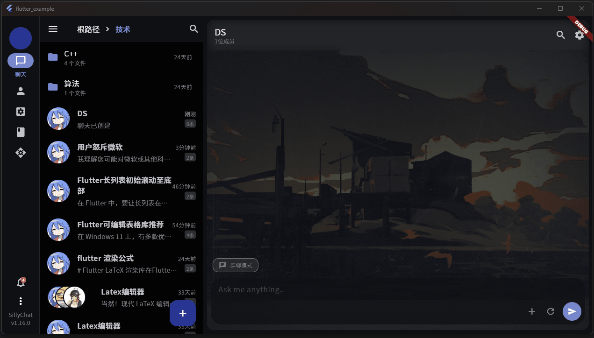
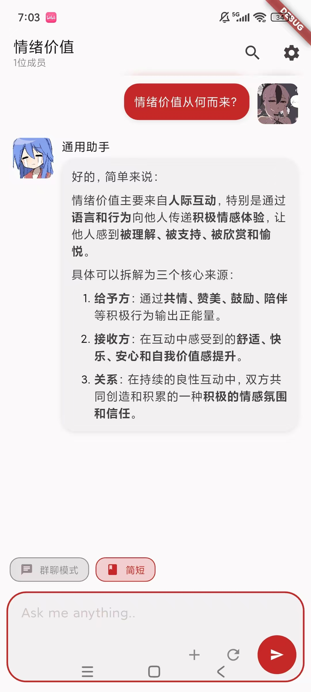
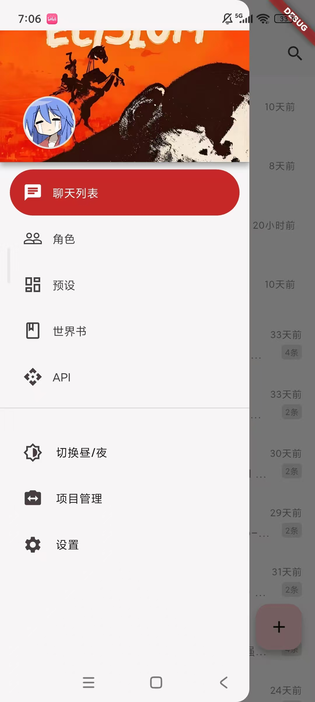

# Silly Chat

---

没错，这又双叒叕是一个类酒馆前端项目。（）

本项目为自用分享。这是一个模仿NextChat和SillyTavern的AI聊天软件，基于Flutter开发，支持桌面/移动端，性能优异（也许吧）。目前已经实现了角色、群聊、世界书、主题简单定制以及若干小功能。

项目定位大概是在NextChat和酒馆之间的APP，主打轻量级，灵活，所以不会有太多乱七八糟的东西（太复杂的功能，前端卡之类的，就算Flutter办得到我也做不出来orz），后续更新主要以基本功能完善/BUG修复/体验优化为主

无需部署，解压即用。

> ⚠️本项目仍在开发中，不保证稳定性

> ⚠️本项目开发以移动端为主，PC端可以使用，但部分操作逻辑未适配


<div style="display:flex">
  
  
</div>

---

## 主要功能

- 📁	用文件夹管理聊天
- 🎭	角色和用户人设
- 🕸️	角色关系网（待完善）
- 👥	群聊功能（手动控制）
- ✏️	编辑消息内容/类型/发送者，批量复制粘贴消息记录
- 🔍	聊天记录搜索
- 🔑	支持openAI、Gemini、DeepSeek等API
- 🍻	导入酒馆的对话预设、角色卡和正则
- ☁️	webDav云同步数据
- 🖼️	发送图片，支持Gemini多模态
- 📚	世界书，支持关键词检索
- 🎨	支持自定义聊天窗口样式、界面主题等

---

## 操作指南

当前版本已经添加了引导界面，根据引导界面进行操作即可。如果在引导界面没有导入角色卡，则你需要手动创建一个角色才能开始聊天。

---

## 开发环境

```
Flutter 3.35.5

// Android端开发环境：
Android SDK 36
Android NDK 29.0.13846066
gradle 8.7

// Windows端开发环境：
Visual Studio 2022
Nuget
```

---

## FAQ

**Q：是否支持自定义/本地模型？**

A：支持兼容OpenAI的自定义模型。


**Q：兼容酒馆吗？**

A：允许导入酒馆的部分预设、正则、角色卡和世界书，暂不支持导出。目前对酒馆的兼容还处于试验阶段，可能会出现各种各样的问题。


**Q：支持文生图/TTS吗？**

A：暂不打算支持，如果你想添加这些功能，欢迎提交PR


**Q：和酒馆相比有什么区别**

A：操作逻辑不同。SillyChat一开始并不是为了兼容酒馆而设计，因此不少逻辑（尤其是提示词管理）和酒馆有较大的区别。

相对酒馆的优点：因为使用Flutter开发，支持跨平台，操作流畅；没有酒馆的历史包袱，添加新功能比较方便。缺点：也是因为用Flutter开发，很难像酒馆一样拥有灵活的插件、主题和前端卡。

---

## 贡献
虽然目前代码仍惨不忍睹，但欢迎提交PR！
你也可以提交Issue来汇报Bug或者一些有趣的功能建议_(:з」∠)_

---

## 许可证
本项目采用 **MIT 许可证**。

对于电脑端，你可以点击主界面左下方省略号按钮->“查看第三方证书”来查看第三方许可证。
