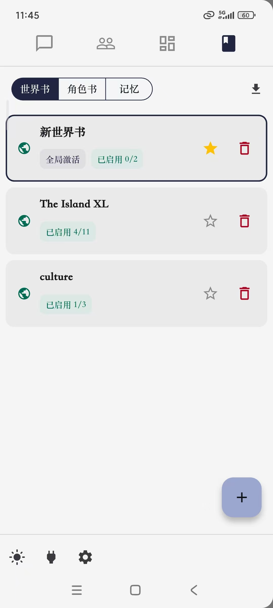
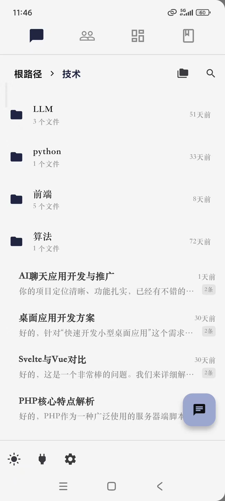

# Silly Chat


---

没错，这又双叒叕是一个类酒馆前端项目。（）

本项目为自用分享。这是一个模仿NextChat和SillyTavern的AI聊天软件，基于Flutter开发，支持桌面/移动端。

项目定位大概是在NextChat和酒馆之间的APP，主打轻量级，灵活，所以不会有太多乱七八糟的东西（太复杂的功能，前端卡之类的，就算Flutter办得到我也做不出来orz），后续更新主要以基本功能完善/BUG修复/体验优化为主

无需部署，解压即用。

> ⚠️本项目仍在开发中，不保证稳定性

> ⚠️本项目开发以移动端为主，PC端可以使用，但部分操作逻辑未适配


<div style="display:flex">
  
  
  
</div>

---

## 主要功能

- 📁	用文件夹管理聊天
- 🍻	导入酒馆的对话预设、角色卡、世界书和正则
- 🕸️	角色关系网可视化
- 👥	群聊功能（手动控制）
- ✏️	聊天内容完全控制：编辑消息内容/类型/发送者，批量复制粘贴消息记录
- 🧩  实用功能：AI帮答、生成标题、导演模式、生成总结、世界书条目临时激活
- 🔍	聊天记录搜索
- 🔑	支持openAI、Gemini、DeepSeek和自定义API，支持余额查询
- ☁️	webDav云同步数据
- 🖼️	发送图片，支持Gemini、OpenAI多模态
- 🎨	自定义聊天气泡样式、颜色主题、从本地导入字体
- 🧠  记忆系统（目前还不完善）
- 📱  安卓后台运行

---

## 上手指南

[最新版本发布页](https://github.com/bilimited/sillyChat/releases/latest)
安卓端：下载app-release-arm64.apk，安装即可。
Windows端：下载Windows-release.zip，解压运行exe文件即可。


当前版本已经添加了引导界面，根据引导界面进行操作即可。如果在引导界面没有导入角色卡，则你需要手动创建一个角色才能开始聊天。
本应用的大部分功能入口都折叠在侧边栏中，点击左上角三横线图标以打开侧边栏。

---

## 开发环境

```
Flutter 3.35.5

// Android端开发环境：
Android SDK 36
Android NDK 29.0.13846066
gradle 8.7

// Windows端开发环境：
Visual Studio 2022
Nuget
```

---

## FAQ

**Q：是否支持自定义/本地模型？**

A：只支持兼容OpenAI的自定义模型。


**Q：兼容酒馆吗？**

A：允许导入酒馆的部分预设、正则、角色卡和世界书，暂不支持导出。目前对酒馆的兼容还处于试验阶段，可能会出现各种各样的问题。


**Q：支持文生图/TTS吗？**

A：暂不打算支持，如果你想添加这些功能，欢迎提交PR


**Q：和其他酒馆类应用（如OMate、Tavo等）相比有什么区别**

A：这是一个个人项目，而不是商业项目。大部分功能都是为了满足作者自己的需求而添加的，因此操作逻辑可能会有些奇怪。
当然，最重要的是它开源免费！


**Q：Why Flutter？**

A：作者不喜欢在网页里玩；Flutter的默认组件很漂亮；Flutter的动画很流畅；作者搞不定Capacitor的safe-area问题。


---

## 贡献

虽然目前代码仍惨不忍睹，但欢迎提交PR！
你也可以提交Issue来汇报Bug或者一些有趣的功能建议_(:з」∠)_

---

## 关于作者和本项目

<details>
  <summary>
    碎碎念
  </summary>

#### 关于这个项目

该项目最开始并不是一个AI聊天软件。它一开始只是一个用来搞OC的“伪聊天APP”（类似momotalk），后来突发奇想加上了AI功能...
除此之外，这是我的第一个flutter项目，所以你可以看到：

- flutter_example包名
- 整形时间戳当作id
- 手写json序列化
- 超级耦合

#### 关于作者

作者目前研一，开发时间有限，如果未来某一天停更了，大概率是因为我被毕设和论文俘虏了_(:з)∠)_

</details>

---

## 许可证
本项目采用 **MIT 许可证**。

对于电脑端，你可以点击主界面左下方省略号按钮->“查看第三方证书”来查看第三方许可证。
